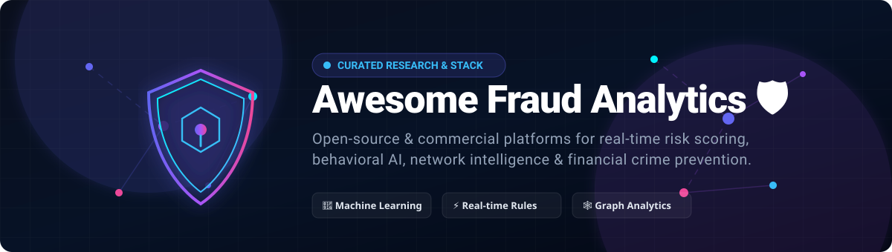

# Awesome Fraud Analytics 🛡️

    

  

 

> **A curated, SEO-optimized list of top fraud analytics platforms, open-source fraud detection engines, machine learning anomaly tools, real-time transaction monitoring systems, anti-money laundering (AML) frameworks, and behavioral risk scoring solutions.** 🚀

---

## 📌 Table of Contents
- [🛡️ Overview](#️-overview)
- [🏢 SaaS / Commercial Fraud Analytics Platforms](#-saas--commercial-fraud-analytics-platforms)
- [💻 Open-Source Fraud Analytics Platforms & Libraries](#-open-source-fraud-analytics-platforms--libraries)
  - [⚡ Core Frameworks & Transaction Monitoring](#-core-frameworks--transaction-monitoring)
  - [🛠️ Specialized ML Libraries & Infrastructure](#️-specialized-ml-libraries--infrastructure)
- [🎯 Quick Start Recommendations](#-quick-start-recommendations)
- [📈 Star History](#-star-history)
- [🤝 Contributing](#-contributing)

---

## 🛡️ Overview

Financial crime, payment fraud, account takeover (ATO), and identity spoofing pose continuous threats to modern digital businesses and financial institutions. This repository indexes both enterprise **SaaS fraud prevention suites** and **production-grade open-source fraud detection building blocks** powered by machine learning, behavioral analytics, entity resolution, and temporal graph networks.

**Primary Focus**: Open-source frameworks, anomaly detection packages, and modular MLOps risk pipelines are emphasized throughout.

---

## 🏢 SaaS / Commercial Fraud Analytics Platforms

The following hosted platforms combine proprietary global consortium networks, device fingerprinting, machine learning models, and rule-based decisioning. *Sorted by estimated company valuation / market cap in descending order.* 📊

| Platform | Description | Key Focus | Company Size (Valuation / Revenue) 📈 | Pricing (Starting Tier) 💰 | Free Tier / Trial Limits ⏳ |
|:---|:---|:---|:---|:---|:---|
| **[FICO Falcon](https://www.fico.com/)** | Enterprise fraud management solution with consortium-trained AI/ML models protecting billions of payment cards worldwide. | Enterprise / Consortium Fraud Models | **~$22B–$23B** Market Cap | Custom Enterprise licensing/quoting | No free trial or public free tier |
| **[Forter](https://www.forter.com/)** | Identity-centric fraud decisioning platform providing real-time approve/decline decisions and policy enforcement across checkout. | Identity & Behavioral Fraud Decisioning | **~$3.0B** Valuation (~$103M Revenue) | Custom Enterprise quoting (per transaction volume / GMV) | No free trial or public free tier |
| **[Feedzai](https://feedzai.com/)** | End-to-end RiskOps financial crime platform combining fraud detection, AML capabilities, and case management for major banks. | Banking-Grade Fraud + AML Analytics | **~$2.0B** Valuation (~$31M Revenue) | Custom Enterprise quoting (typically $50,000+/year) | No free trial (personalized risk assessments only) |
| **[Sift](https://sift.com/)** | Real-time ML fraud platform delivering risk scores, global signal intelligence, account defense, and workflow automation. | Real-Time Risk Scoring + Global Signals | **~$1.0B** Valuation (~$158M Revenue) | Custom Enterprise quoting (volume-based, starting ~$500–$1,000+/mo) | No free trial or free tier for Fraud suite |
| **[Riskified](https://www.riskified.com/)** | E-commerce fraud prevention platform offering 100% chargeback guarantees, adaptive checkout, and merchant network decisioning. | E-Commerce Fraud Analytics + Guarantee | **~$716M** Market Cap (~$229M Revenue) | Custom Enterprise quoting (per-approved transaction fee + guarantee) | No free trial or public free tier |
| **[Kount](https://kount.com/)** (Equifax) | Omnichannel risk scoring engine combining device intelligence, custom business rules, and chargeback prevention. | Device Intelligence + Rules-Based Analytics | Acquired by Equifax for **$640M** | Custom Enterprise quoting (integrations ~$1,000/mo; Kount 360 base ~$25/mo) | No free trial for enterprise platform |
| **[Featurespace](https://www.featurespace.com/)** | Adaptive behavioral analytics platform (ARIC™ Risk Hub) specializing in real-time anomaly detection and low-prevalence fraud patterns. | Adaptive Behavioral Analytics | Acquired by **Visa** (2024; ~£50M Rev) | Custom Enterprise quoting (volume/account based) | No free trial or public free tier |
| **[SEON](https://seon.io/)** | Data enrichment and fraud prevention platform with digital footprint analysis, social lookup, and hybrid AI/rules engine. | Data Enrichment + Flexible Fraud Scoring | Private (~$35M ARR) | Starter tier from $699/month (10 users & 50 rules) | 14-day free trial; transitions to Forever Free (2,000 API calls/mo, 2 QPS) |
| **[Sardine](https://www.sardine.ai/)** | Adaptive fraud detection platform with 12,000+ features, consortium intelligence, and instant payment risk decisioning. | Adaptive ML + Feature-Store Fraud Detection | Private (~$50M+ ARR scaling) | Custom Enterprise quoting ($50,000+/year minimum commitment) | No free trial or public free tier |
| **[Fraud.net](https://www.fraud.net/)** | Enterprise payment fraud detection platform with AI orchestration, entity linkage, and workflow case management. | Enterprise Payment Fraud Analytics | Private Enterprise Scale | Custom Enterprise quoting (volume-based) | 30-day free trial available upon request / guided trial demo |

---

## 💻 Open-Source Fraud Analytics Platforms & Libraries

Open-source solutions empower organizations to maintain total data privacy, run self-hosted transaction monitoring, and train specialized ML models.

### ⚡ Core Frameworks & Transaction Monitoring
*Sorted by GitHub Star Count (Descending)* 🌟

| Project | Github_Stars 🌟 | Description | License | Focus Area |
|:---|:---|:---|:---|:---|
| **[Drools](https://github.com/kiegroup/drools)** |  | Powerful open-source business rules engine (BRMS) extensively used for real-time fraud policies, compliance logic, and instant transaction decisioning. | Apache-2.0 | Policy & Rules Decisioning |
| **[Tazama](https://github.com/tazama-lf/tazama)** |  | Linux Foundation open-source real-time transaction monitoring platform designed for financial fraud detection, AML, and instant payment surveillance. | Apache-2.0 | Real-Time Financial Surveillance |
| **[Jube](https://github.com/jube-home/aml-fraud-transaction-monitoring)** |  | Self-hosted open-source AML and fraud detection platform featuring rule execution, machine learning pipelines, and investigation case management. | AGPLv3 | Transaction Monitoring & AML |
| **[Marble](https://github.com/marble-engine/marble)** |  | Lightweight, extensible open-source decisioning engine and rule builder tailored for fintech fraud screening and risk checks. | MIT | Open Decisioning Engine |
| **[Rift](https://github.com/AngelP17/Rift)** |  | Graph-native intelligence system combining GraphSAGE and XGBoost for entity resolution, link analysis, and drift monitoring. | Open Source | Graph Entity Resolution & Risk |
| **[CreditGuard API](https://github.com/ishandutta2007/Awesome-Fraud-Analytics)** |  | MLOps reference scoring service built with FastAPI, XGBoost/LightGBM, MLflow, and streaming inference endpoints. | MIT | MLOps Credit & Risk Scoring API |

---

### 🛠️ Specialized ML Libraries & Infrastructure
*Sorted by GitHub Star Count (Descending)* 🌟

| Library / Tool | Github_Stars 🌟 | Description | Focus Area |
|:---|:---|:---|:---|
| **[scikit-learn](https://github.com/scikit-learn/scikit-learn)** |  | Essential machine learning library supplying Isolation Forest, One-Class SVM, and Local Outlier Factor (LOF) for fraud anomaly scoring. | Anomaly & Outlier Analytics |
| **[PyTorch Geometric](https://github.com/pyg-team/pytorch_geometric)** |  | Graph Neural Network (GNN) framework used to detect fraud rings, money laundering networks, and complex entity connections. | Graph Fraud ML & Network Linkage |
| **[PyOD](https://github.com/yzhao062/pyod)** |  | Comprehensive Python toolkit containing 40+ supervised and unsupervised outlier detection algorithms optimized for fraud mining. | Unsupervised Fraud Detection |
| **[Feast](https://github.com/feast-dev/feast)** |  | Open-source feature store powering ultra-low-latency real-time risk features (velocity metrics, device stats, historical aggregates). | Real-Time Risk Feature Store |
| **[SHAP](https://github.com/shap/shap)** |  | Game-theoretic model explainability library ensuring full transparency and compliance audit trails for ML risk decisions. | Model Interpretability & Compliance |
| **[Evidently](https://github.com/evidentlyai/evidently)** |  | Open-source evaluation tool for monitoring data drift, concept drift, and model performance degradation in fraud scoring engines. | MLOps & Risk Model Monitoring |

---

## 🎯 Quick Start Recommendations

| Use Case / Requirement 📌 | Recommended Platform / Tool 💡 |
|:---|:---|
| **Self-Hosted Real-Time Transaction & AML Surveillance** | **[Tazama](https://github.com/tazama-lf/tazama)** or **[Jube](https://github.com/jube-home/aml-fraud-transaction-monitoring)** |
| **Deterministic Business Policy & Rule Management** | **[Drools](https://github.com/kiegroup/drools)** or **[Marble](https://github.com/marble-engine/marble)** |
| **Graph-Based Fraud Ring & Entity Resolution** | **[PyTorch Geometric](https://github.com/pyg-team/pytorch_geometric)** or **[Rift](https://github.com/AngelP17/Rift)** |
| **Unsupervised Anomaly & Outlier Mining** | **[PyOD](https://github.com/yzhao062/pyod)** & **scikit-learn** |
| **Real-Time Feature Computation & Low-Latency Serving** | **[Feast](https://github.com/feast-dev/feast)** + Apache Kafka |
| **Banking-Grade Enterprise RiskOps & AML** | **[Feedzai](https://feedzai.com/)** or **[FICO Falcon](https://www.fico.com/)** |
| **Digital Footprint & Data Enrichment Analytics** | **[SEON](https://seon.io/)** |
| **E-Commerce Approval Rates & Chargeback Guarantees** | **[Riskified](https://www.riskified.com/)** or **[Forter](https://www.forter.com/)** |

---

## 📈 Star History

<a href="https://www.star-history.com/?repos=ishandutta2007%2FAwesome-Fraud-Analytics&type=date&legend=bottom-right">
<picture>
<source media="(prefers-color-scheme: dark)" srcset="https://api.star-history.com/chart?repos=ishandutta2007/Awesome-Fraud-Analytics&type=date&theme=dark&legend=bottom-right" />
<source media="(prefers-color-scheme: light)" srcset="https://api.star-history.com/chart?repos=ishandutta2007/Awesome-Fraud-Analytics&type=date&legend=bottom-right" />

</picture>
</a>

---

## 🤝 Contributing

Contributions, corrections, and new open-source project additions are always welcome! 🌟  
Please read our guidelines and submit a Pull Request or open an Issue.

---

**Last updated**: August 2026  
*Maintained with ❤️ for the open-source fraud analytics and cybersecurity community.*
